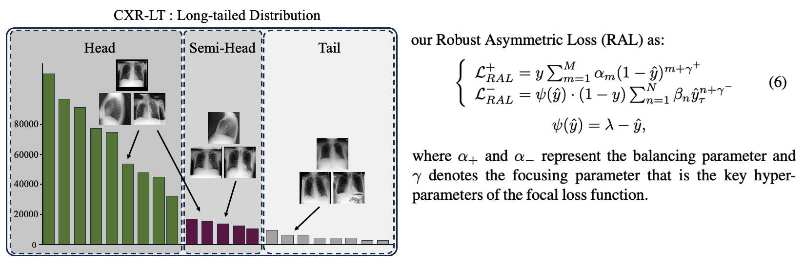

## Robust Asymmetric Loss for Multi-Label Long-Tailed Learning

> Robust Asymmetric Loss for Multi-Label Long-Tailed Learning<br/>
> [Wongi Park](https://www.linkedin.com/in/wongipark/), [Inhyuk Park](https://sites.google.com/view/jongbinryu/about-me?authuser=0), [Sungeun Kim](https://sites.google.com/view/jongbinryu/about-me?authuser=0), [Jongbin Ryu](https://sites.google.com/view/jongbinryu/about-me?authuser=0).<br/> 
> (Comming soon..), <br/>



## Environment Setting
- **Conda environment**
: Ubuntu 18.04 CUDA-10.1 (10.2) with Pytorch==1.13.0, Torchvision==0.6.0 (python 3.8), libauc, torchmetrices==0.8.0.<br/>

```
# Create Environment
conda create -n ral python=3.8
conda activate ral

# Install pytorch, torchvision, cudatoolkit
conda install pytorch==1.13.0 torchvision==0.6.0 libauc==1.3.0 cudatoolkit=10.1 (10.2) -c pytorch
```

<a id="dataset"></a>
## Benchmark Dataset

- **How to get dataset?**

1. MIMIC-CXR 2.0 : [MIMIC-CXR 2.0](https://physionet.org/content/mimic-cxr/2.0.0/)
2. APTOS 2019 Blindness : [APTOS2019](https://www.kaggle.com/c/aptos2019-blindness-detection)
3. ISIC2018 Challenge :  [ISIC2018](https://challenge.isic-archive.com/)

- **Directory structure of our project**
```
- Directory
  - run.sh                : shell Script Version (train, infer)
  - main.py               : Main Execution (Args, Setting)
  - dataset               : Augmentation, DataLoader
      - ...
  - train.py               : training, validation
  - predict.py             : inference   
      - ...
  - utils                 : Distribution Setting, Metrics
      - ...
```

## Supporting papers

(1) Focal Loss for Dense Object Detection  ([Paper](https://arxiv.org/abs/1708.02002v2) / [Code](https://github.com/unsky/focal-loss))
(2) Asymmetric Loss For Multi-Label Classification  ([Paper](https://arxiv.org/abs/2009.14119) / [Code](https://github.com/Alibaba-MIIL/ASL))
(3) Simple and Robust Loss Design for Multi-Label Learning with Missing Labels  ([Paper](https://arxiv.org/abs/2112.07368) / [Code](https://github.com/xinyu1205/robust-loss-mlml))


## Training & Inference

```
Train
torchrun --nproc_per_node=8 main.py --gpu_ids 0,1,2,3,4,5,6,7 --seed 0 --train 1 --model convnext --batchsize 64 --epochs 30
```

```
Inference
torchrun --nproc_per_node=8 main.py --gpu_ids 0,1,2,3,4,5,6,7 --seed 0 --img_size 1024 --infer 1 --model convnext --batchsize 20 --epochs 200 --store_name fold --save_model 1
```

The results will be automatically saved in ./workspace/[model name]/[Workspace Name].

## How to cite
```
@article = {
    title = {Robust Asymmetric Loss for Multi-Label Long-Tailed Learning},
    author = {Wongi Park, Inhyuk Park, Sungeun Kim, Jongbin Ryu},
    Paper = {...},
    url = {https://github.com/kalelpark/RAL},
    year = {2023},
}
```